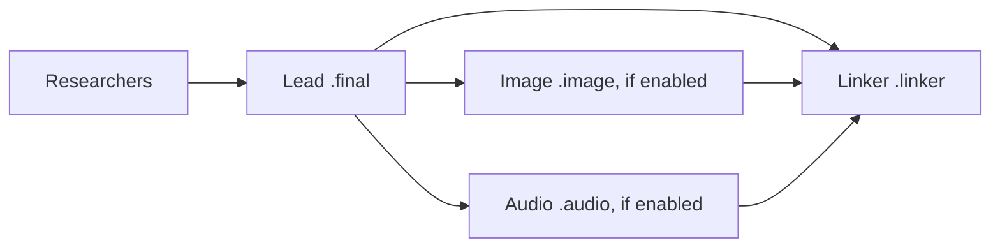

# Run research swarm audio and image agents in parallel

## Outcome and scope

With `#research_swarm(prompt="...", image=true, audio=true)`, the image and audio agents
each depend only on the lead's `.final` agent. The linker remains the final publishing
step and waits for the lead and both enabled media agents. Audio uses sase-listen's
generated square title card rather than the report's infographic, even when that
infographic already exists or a reused narration script names it as its cover.

This is one bounded implementation for one follow-up agent, so use a `tale` with size
`medium`. The work crosses two linked repositories: the research plugin owns the swarm
and narration prompts; sase-listen owns cover selection. Implement the renderer
capability first, then update its caller and prove the dependency graph through the
existing launch planner.

## Established behavior and relevant files

Open `sase-research-artifacts` and `sase-listen` with
`sase repo open <name> -r "Implement the approved research swarm parallel media plan"`
from the current workspace. Use only the printed checkout paths, and read each
repository's `AGENTS.md` before editing. All paths below are relative to their named
repo.

In **sase-research-artifacts**:

- `src/sase_research_artifacts/xprompts/research_swarm.md` contains nine authored
  segments. The image segment waits for and forks from `.final`. The audio segment also
  forks from `.final` but currently adds a conditional `.image` wait. The linker already
  waits for `.final`, `.image` when enabled, and `.audio` when enabled. The `audio`
  input description documents the serial behavior. Audio is authored after the linker;
  execution order comes from the dependency graph, so changing segment order is
  unnecessary.
- `src/sase_research_artifacts/xprompts/research_audio.md` tells the audio agent to
  select `<stem>_infographic.png` after syncing. It otherwise reuses an existing
  `<stem>_narration.md` unless `rewrite=true`, renders with `--json`, registers an
  `audio:<episode_id>` MP3, and publishes the `audio` variable.
- `tests/test_macro_loading.py` already checks authored and expanded segments and, in
  `test_research_swarm_audio_planner_edges_and_lead_source`, resolves their real logical
  waits with `plan_typed_launch_units`. Several assertions currently require the
  audio-to-image wait.
- `README.md` and `docs/macros.md` describe audio waiting for the image and adopting its
  infographic cover.

In **sase-listen**:

- `src/sase_listen/cli/render.py` defines `render --cover` and constructs
  `RenderRequest`.
- `src/sase_listen/pipeline.py` defines `RenderRequest`, `render`, and
  `resolve_cover_bytes`. Current cover precedence is CLI path, script frontmatter, a
  sibling `<source-stem>_infographic.png`, then generated art. Rendering a narration
  script uses its narration filename for that sibling lookup. Omitting frontmatter alone
  therefore is not an explicit guarantee of generated art, especially with reused
  scripts.
- `src/sase_listen/audio/cover.py` already generates deterministic square title cards
  through `resolve_cover(None, ...)`; reuse that implementation.
- `src/sase_listen/data/guide.md`, returned by `sase-listen guide`, currently directs
  authors to set an infographic cover. `docs/narration-scripts.md` repeats that guide.
  `docs/cli.md` and `docs/architecture.md` document rendering and cover selection.
- `tests/test_pipeline.py`, `tests/test_cli.py`, and `tests/audio/test_cover.py` provide
  isolated tone rendering, CLI parsing, and deterministic cover checks. This repo is
  standalone and intentionally has no SASE/Rust imports.

## Intended dependency graph

With sufficient runner capacity, media work before linking takes approximately
`max(image duration, audio duration)` instead of their sum. Existing queue capacity,
priority, and quarter-weight admission still govern when each starts.

## Implementation

1. **Add an explicit generated-cover render choice in sase-listen.** Add
   `-g/--generated-cover` to the render parser in a mutually exclusive group with the
   existing `--cover` path. Help must explain that it generates the title card and
   ignores frontmatter and sibling artwork. Pass a default-false `generated_cover`
   boolean through `RenderRequest` to `resolve_cover_bytes`; append the request field to
   preserve existing positional construction and give the resolver parameter a default
   to preserve existing callers. When true, call the existing `resolve_cover(None, ...)`
   with the same title, kind, date, and site metadata before inspecting image
   candidates. Reject conflicting programmatic `cover` and `generated_cover` choices
   with the existing usage-error contract before loading or synthesizing, including dry
   runs. Default render behavior and explicitly supplied custom covers continue to use
   the established precedence.

2. **Remove the swarm scheduling edge and change the audio prompt.** In
   `research_swarm.md`, remove only the audio segment's conditional
   `%wait:research.{@1}.image`. Keep its `.final` wait, lead fork, edition/model
   selection, and queue directives. Keep the linker's conditional waits for both enabled
   media agents. Rewrite the `audio` input description to state that audio runs
   alongside the optional image agent and uses a generated title card.

   In `research_audio.md`, replace the automatic infographic-cover selection
   instructions with the generated-title-card policy. Newly authored scripts omit
   `cover`; reused scripts retain their narration and metadata, with the render option
   overriding any existing artwork. The render command becomes
   `sase tool run -- sase-listen render <script> --generated-cover --json`, with the
   same option carried into any `/sase_monitor` handoff and follow-up. Apply this policy
   to direct `#research/audio` invocations too, so there is one consistent research
   audio default.

   Keep the lead's `<name>__final.md` as the swarm narration source, even if `<name>.md`
   has appeared. Keep the explicit `@research:` selection rule, source/blob provenance,
   lint checks, brief/full editions, script reuse, artifact registration, and
   audio-variable success/failure contracts.

3. **Align the shipped authoring guide and runtime compatibility.** Update sase-listen's
   shipped guide and mirrored narration-script docs to show `cover` as optional
   explicitly chosen artwork rather than requiring a report infographic; explain the
   generated-cover choice for research audio. Update renderer CLI and architecture
   documentation for the override.

   The plugin invokes sase-listen at runtime and must retain that packaging arrangement.
   In its CLI-selection instructions, prefer an installed `sase-listen` only when
   `render --help` advertises `--generated-cover`; otherwise check the existing
   `uvx sase-listen` fallback for the same capability before rendering. If neither
   supports it, report the upgrade requirement through the normal `audio.ok=false`
   handoff and complete so the linker can publish. Do not silently drop the option. This
   allows the two repos to land together without claiming that an older published CLI
   already supports the new option. Capability probing requires no live TTS.

4. **Update plugin documentation.** Revise `README.md` and `docs/macros.md` to describe
   the two independent lead-dependent media agents, generated podcast title cards, and
   the linker joining all enabled outputs. Retain the infographic in the canonical
   report and the existing listen-card and `audio:` frontmatter behavior. Check
   descriptions and examples for stale claims that audio waits for an image or
   automatically uses its cover.

## Verification and acceptance

In **sase-research-artifacts**, update the existing authored-graph and expanded audio
tests, including the combined image/audio and full-edition cases. The parametrized
real-planner test must prove, with `audio=true` across all existing `linker`/`image`
combinations:

- Audio waits exactly for the lead, regardless of `image`.
- Image, when enabled, waits exactly for the lead.
- Linker waits exactly for the lead and the enabled media agents, with no accidental
  media-to-media edge or cycle.
- Fully expanded audio uses the lead source and generated-cover render option; the
  capability and failure instructions survive expansion. Queue settings, segment counts,
  model routing, edition propagation, and `audio=false` behavior remain covered by the
  existing suite.

In **sase-listen**, add focused tests proving the public behavior:

- Long and short option forms reach the render request; combining an image path with
  generated-cover mode is a CLI usage error, and conflicting library requests also fail
  before synthesis.
- Generated-cover resolution returns the expected deterministic card with the same
  metadata when frontmatter names an infographic, including a missing or unreadable
  image, and when a sibling infographic is present. Run the same case with artwork
  absent and present to prove timing cannot alter the bytes. Existing explicit-cover and
  default-precedence tests pass.
- One isolated tone-engine render using a reused narration script with an infographic
  `cover` produces the expected `cover.jpg` and embeds those bytes as the MP3's APIC
  cover, while leaving the source script unchanged. Keep publishing disabled and use the
  existing isolated library/config fixtures.

Run `sase tool run check` from each modified linked checkout. This is the required
wrapped `just check`; use `/sase_monitor` if a check is long. The primary sase checkout
needs its own check only if implementation actually changes tracked files there. No
scheduler/backend change is anticipated. Live research, image generation, paid TTS, and
feed publishing are unnecessary for these checks. Inspect the final diffs and run a
focused search for obsolete image-wait/infographic-cover instructions after the tests
pass.

Completion means both linked repositories pass their checks, the planner proves sibling
media dependencies, and actual generated cover bytes are independent of available
infographic files. Submit host-owned final declarations for every changed repository
through `/sase_final`; let the host create the commits. This planning turn makes only
this disposable plan file and submits it through `sase plan propose` before
implementation.
