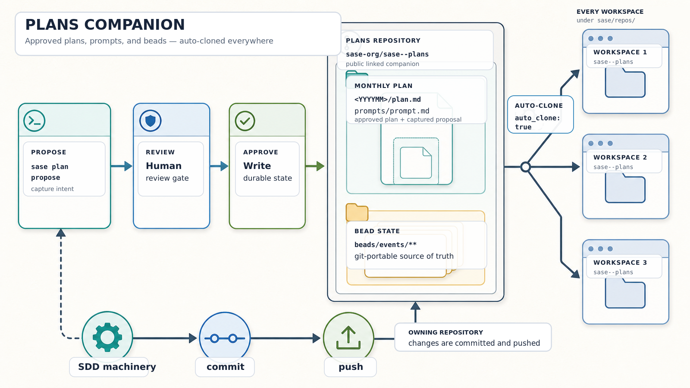

# SASE Plans

This public sidecar repository stores the durable planning state for its SASE-managed source repository. SASE
automatically clones it into each workspace and keeps plan files, their original prompt snapshots, and bead state
available to humans and agents.

## Directory Layout

- `<YYYYMM>/*.md` stores plan files. Every plan declares `tier: tale` or `tier: epic` in YAML frontmatter.
- `<YYYYMM>/prompts/*.md` stores the original prompts or expanded snapshots that produced that month's plans.
- `beads/` stores SASE bead events and compatibility projections. SQLite `beads.db*` files are local-only.
- `assets/` stores generated explanatory media used by this README.

Plan and prompt links are relative to this repository root. For example, `202607/example.md` links back to
`202607/prompts/example.md`.

## Commands

- `sase plan list` and `sase plan search` inspect plans.
- `sase repo path plans` prints this clone's root.
- `sase plan links validate` checks prompt and plan frontmatter links.
- `sase bead` manages bead work stored under `beads/`.
