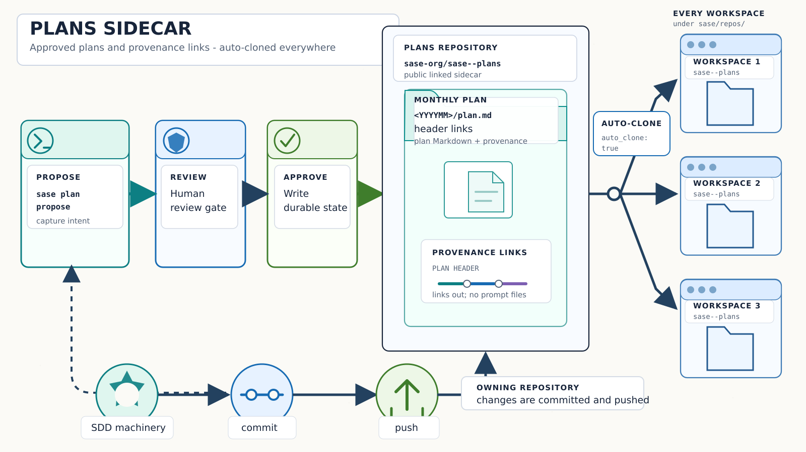

# SASE Plans

This public sidecar repository stores the durable planning state for its SASE-managed source repository. SASE
automatically clones it into each workspace and keeps plan files available to humans and agents. Canonical prompt
Markdown and prompt-linked artifacts live in the separate `--agents` sidecar repository; bead state lives in the
separate `--beads` sidecar repository.



## Directory Layout

- `<YYYYMM>/*.md` stores plan files. Every plan declares a non-empty `title` and either `tier: tale` or `tier: epic` in
  YAML frontmatter.
- Plan `PROMPT` header links point to `prompts/<YYYYMM>/*.md` files in the project's `--agents` sidecar. Historical
  `<YYYYMM>/prompts/*.md` files may remain readable during migration, but new committed run prompts are not stored here.
- `assets/` stores generated explanatory media used by this README.

## Plan Header Block

Every plan opens with a **header block**: a contiguous run of clickable top-of-body Markdown bullets carrying the plan's
provenance. YAML frontmatter, when present, begins at byte zero; the block is the first Markdown body element and has
exactly one blank line after it.

```markdown
- **PROMPT:** [prompts/202607/example.md](https://github.com/<org>/<repo>--agents/blob/main/prompts/202607/example.md)
- **PARENT:** [202607/parent_epic.md](https://github.com/<org>/<repo>--plans/blob/main/202607/parent_epic.md)
- **AGENTS:**
  - [user.host.sase-1a.2](https://github.com/<org>/<repo>--agents/blob/main/agents/user.host.sase-1a.2/README.md)
- **COMMITS:**
  - [699456a](https://github.com/<org>/<repo>/commit/699456a521e25e0aaa38f4e289db38e71a6488a6) — feat: ship the thing
```

Section order is fixed: `PROMPT`, `PARENT`, `BEAD`, `AGENTS`, `ARTIFACTS`, `COMMITS`. Prompt archives carry a `PLAN`
section instead (`- **PLAN:** [202607/example.md](https://github.com/<org>/<repo>--plans/blob/main/202607/example.md)`)
and may also carry `AGENTS` and `ARTIFACTS` sections. Sub-bullets are indented two spaces and deterministically ordered
— agents by name, artifacts by rendered prompt order, commits by commit time then SHA. A section with nothing to show is
omitted entirely, and long lists are capped with a visible `… and N more` sub-bullet rather than truncated silently.

Link policy: `PROMPT` and `PLAN` accept cross-repository hosted URLs as well as historical file-relative hrefs.
`PARENT`, `AGENTS`, and `COMMITS` link to GitHub when the store has a resolvable hosted remote, and degrade to a
file-relative href (`PARENT`) or an unlinked label (`AGENTS`, `COMMITS`) rather than guessing a URL. `ARTIFACTS` links
to hosted version-control blobs or to files under the agents sidecar's `artifacts/<YYYYMM>/` archive. Labels stay stable
across those fallbacks.

`AGENTS` and `COMMITS` are a **projection of durable state, never an accumulator**: they are re-derived from commit
footers and agent metadata on every refresh, so correcting the source removes a stale entry. An epic plan's sections
also include its descendant plans' agents and commits. A plan's parent is recorded in the `PARENT` bullet; the
historical `parent:` frontmatter property is deprecated and migrated on refresh.

## Commands

- `sase plan list` and `sase plan search` inspect plans.
- `sase repo path plans` prints this clone's root.
- `sase agent prompts list`, `show`, and `validate` inspect the canonical agents-sidecar prompt archive.
- `sase plan links validate` checks plan header links, including cross-repository prompt links.
- `sase plan links refresh` previews header-block reconciliation across every plan; add `--write` to update and commit
  changed plans, or `--plan <ref>` to scope the run to one plan.
- `sase plan links repair` previews legacy or stale links; add `--write` for a one-time canonical-bullet migration.
- `sase repo path beads` prints the sibling beads sidecar clone that stores bead state.

Historical plain-path and inline-Markdown frontmatter values remain readable and valid. Search, validation,
initialization, and upgrades do not rewrite them automatically; conflicting representations are reported instead of
silently selected. Use `sase plan links repair --write` for explicit migration.
